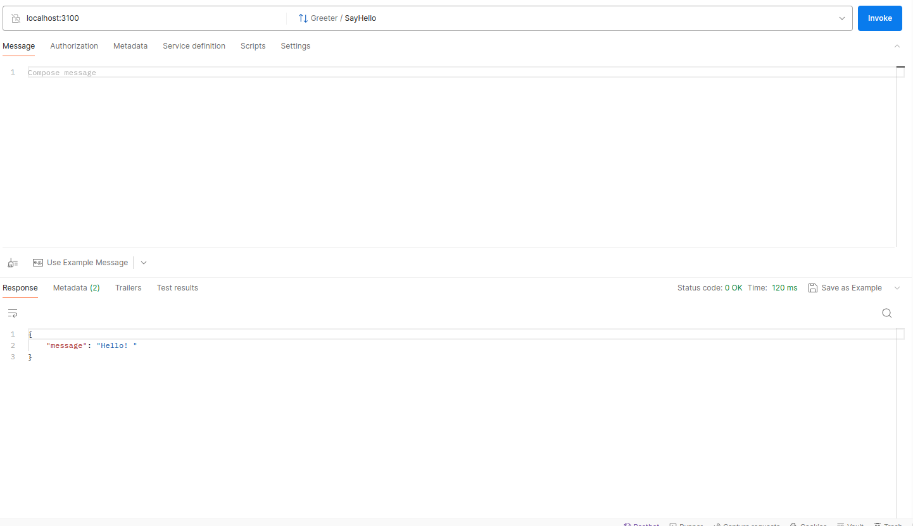
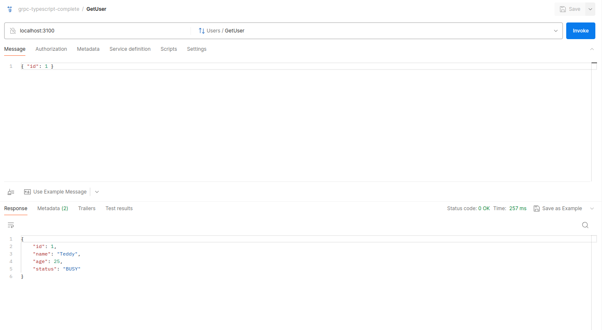
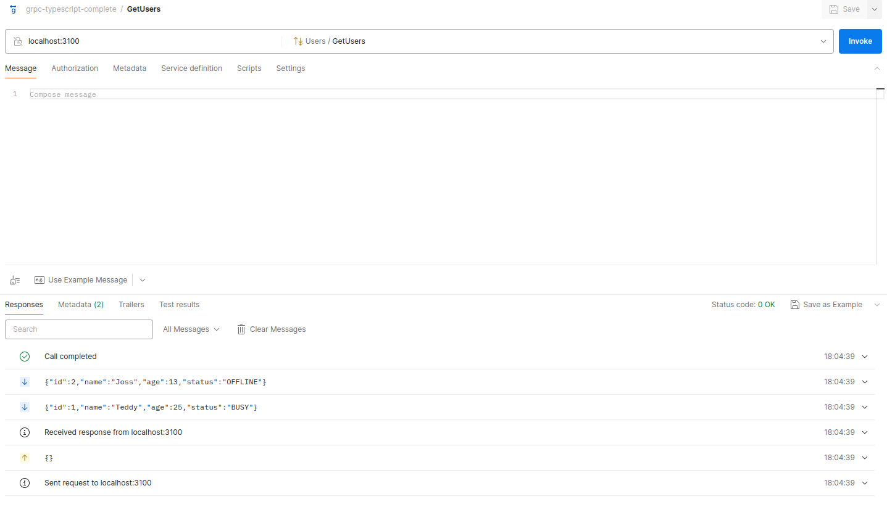

# gRPC microservices implementation using Typescript
#### by Shubhrendu Tripathi

This is a Typescript based gRPC example. There are two services implemented:

(1) <ins>Greeter Service</ins>

This is a basic Hello World service.

(2) <ins>User Service</ins>

This service provides the following three functions:

    (a) GetUser
    (b) CreateUsers
    (c) GetUsers

## Setup

using yarn

yarn init -y

yarn add typescript -D

yarn run tsc --init

yarn add @grpc/grpc-js

yarn add ts-node grpc-tools @types/google-protobuf 

grpc_tools_node_protoc_ts -D

## Add Proto files

configure package.json scripts to run proto/build.sh script

## Server

npm run proto:server

npm run server

## Client

npm run proto:client

npm run client

## Postman

### SayHello

### GetUser

### GetUsers

